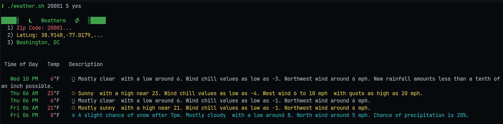
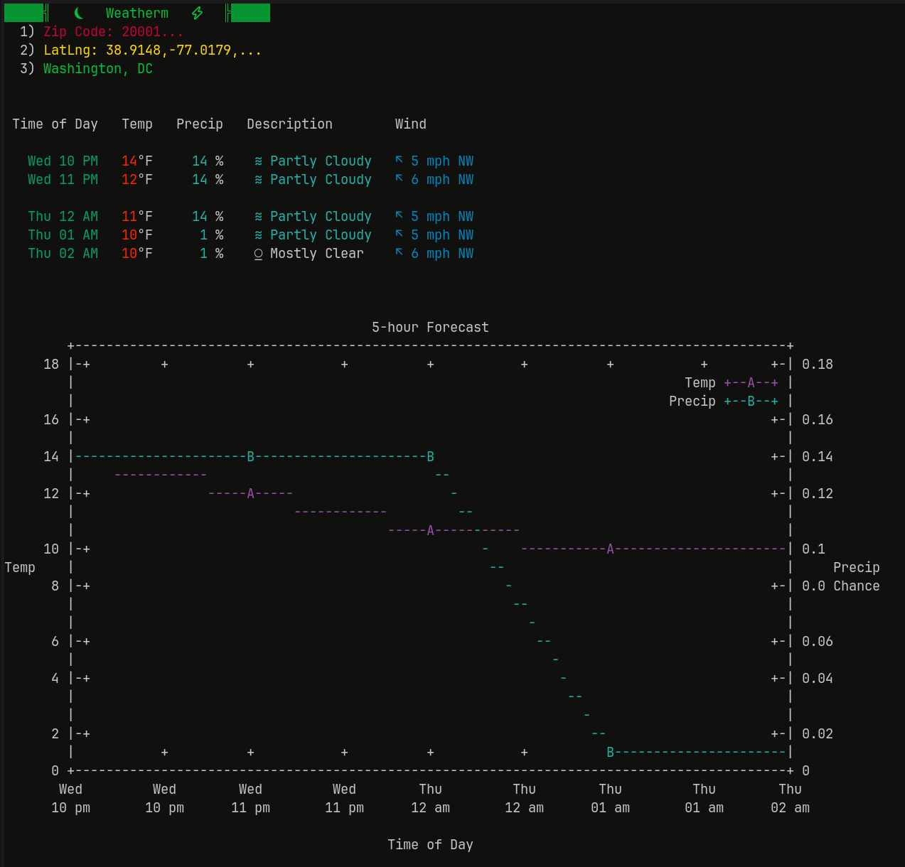
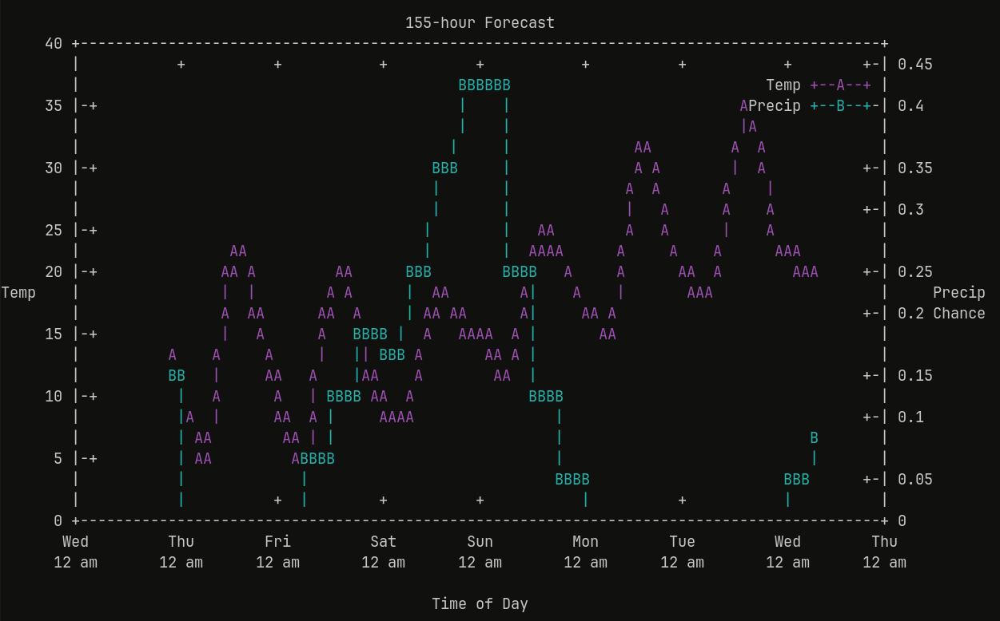

# WEATHERM
A weather forecast report without leaving the comfort of your terminal.

### Examples
#### Brief Summary Mode

#### Extensive Detail Mode

#### Maximum Graph Forecast


### Setup
Requires `python` and its `json, os, sys` libraries (which are included in the python standard library by default).
Also uses several common shell utilities and one uncommon one: `feedgnuplot`. This can be installed with `yay -S feedgnuplot`.

### Running the script
Download `weather.sh`. It accepts 3 positional arguments: 
 - A five digit zip code 
 - A 1-155 hour forecast window
 - yes/no for a summarized view

A summary view has a longer textual description of weather by day and evening (for up to a week in advance), while the normal view has an hourly view with a brief description of weather along with precipitation potential, wind speed, and wind direction. It also generates a graph of the temperature and precipitation potential for the specified forecast window.

For simplicity, add your home address, preferred hour window, and preferred mode to your shell aliases: 

```bash
# aliases.sh
alias weather='[script_path]/weather.sh 20001 12 no'
```
